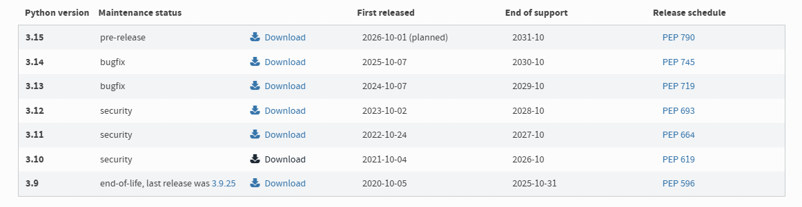
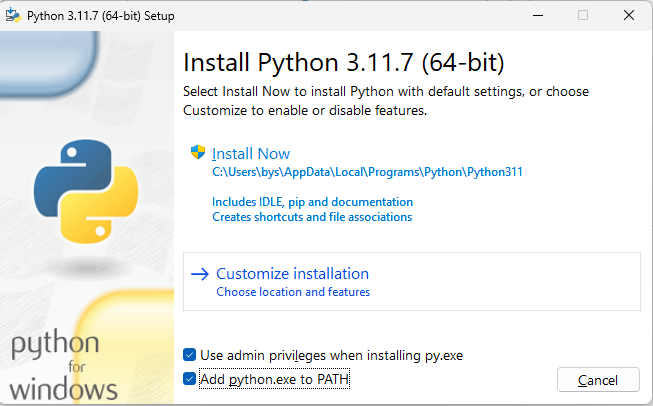
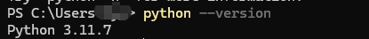
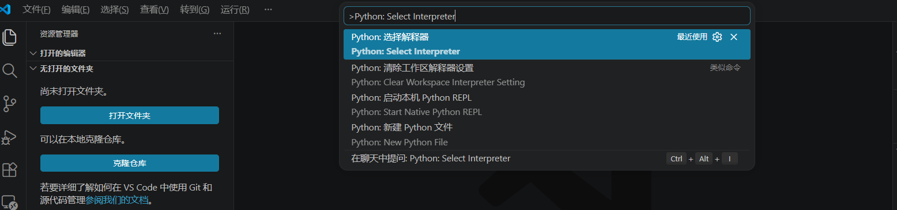
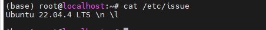
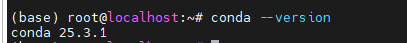
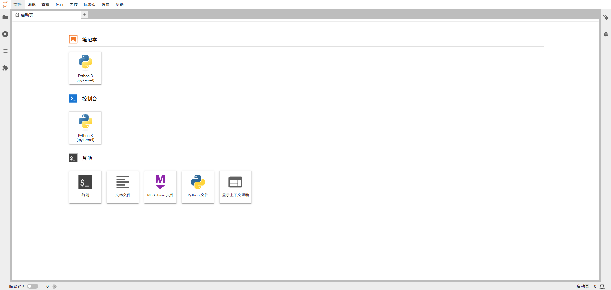
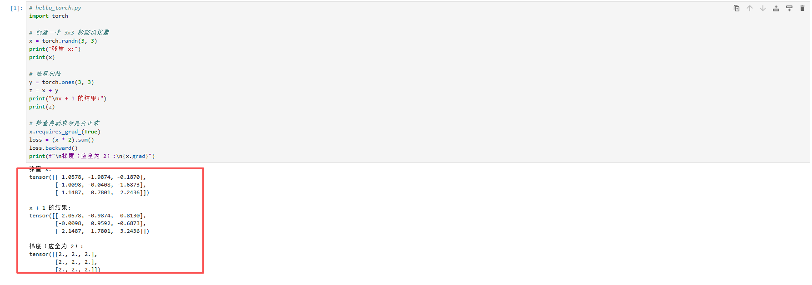

## 为什么写这篇文章

很多朋友想学 AI 大模型，但第一步就被环境卡住了——Python 装哪个版本？CUDA 要不要装？虚拟环境是什么？为什么照着教程做还是报错？

这篇文章的目标是：**在一台普通笔记本（Windows / macOS / Linux 均可）上，从头搭好一套能写代码、能跑 PyTorch 的环境。** 全程没有任何 AI 基础也能跟下来。

## 环境概览

这套环境搭建好之后，你得到的是：

| 组件 | 用途 |
|:---|:---|
| **Python 3.10+** | AI 生态最主流的语言版本 |
| **VS Code** | 轻量编辑器，AI 开发的首选 |
| **venv / Miniconda** | Python 虚拟环境，隔离项目依赖（推荐新手用 Miniconda） |
| **PyTorch** | 最流行的深度学习框架（CPU 版即可起步） |
| **Git**（可选） | 代码版本管理，后续必用 |

不管你未来是做 NLP、CV 还是大模型微调，这套基底足够你跑完整个入门阶段。

---


## 第一步：安装 Python

### 选什么版本

Python 3.10 或 3.11 是目前 AI 生态兼容性最好的选择。PyTorch、HuggingFace Transformers、vLLM 等主流库都做了针对性优化。

> **不建议**用 Python 3.12+，部分 AI 库的依赖还没完全适配；也不要用系统自带的 Python 2.x。

### 安装步骤

**Windows**

1. 去 [Python 官网](https://www.python.org/downloads/) 下载 Python 3.10.x或3.11.x

   

2. 安装时 **务必勾选 "Add Python to PATH"**

   

3. 打开终端（cmd 或 PowerShell），验证：

```bash
python --version
# 输出示例：Python 3.11.7
```



**macOS / Linux**

```bash
# macOS（Homebrew）
brew install python@3.11

# Ubuntu / Debian
sudo apt install python3.11 python3.11-venv python3-pip
```

### 验证 Pip

```bash
pip --version
```

如果提示 `pip` 找不到，试试 `pip3`。关于 pip 和 pip3 的区别，其实只是命名习惯，在虚拟环境里它们完全等价。

---

## 第二步：安装 VS Code 与必备扩展

### 下载 VS Code

去 [code.visualstudio.com](https://code.visualstudio.com/) 下载对应系统的版本，安装过程一路默认即可。

### 必装扩展

打开 VS Code，点击左侧扩展图标（或按 `Ctrl+Shift+X`），搜索并安装这几个：

| 扩展名 | 作用 |
|:---|:---|
| **Python**（微软官方） | Python 语法高亮、IntelliSense、调试 |
| **Pylance** | 更快的代码补全和类型检查 |
| **Jupyter** | 在 VS Code 里运行 .ipynb 笔记本 |
| **GitLens**（可选） | 让 Git 历史更直观 |

装完后按 `Ctrl+Shift+P`，输入 "Python: Select Interpreter"，应该能看到你刚才安装的 Python 版本。选上它，VS Code 就知道用哪个 Python 了。



---

## 第三步：创建虚拟环境

虚拟环境是 Python 开发里**最容易跳过但最重要**的一步。它解决的是依赖冲突问题：项目 A 用 PyTorch 2.0，项目 B 用 PyTorch 1.13，如果没有虚拟环境，它们会在系统里打架。

### 3.1 **venv**

#### 在项目目录下创建

```bash
# 创建一个项目目录
mkdir ai-learning
cd ai-learning

# 创建虚拟环境（会在当前目录生成 venv/ 文件夹）
python -m venv venv

# 激活虚拟环境

# Windows (cmd)
venv\Scripts\activate

# Windows (PowerShell)
venv\Scripts\Activate.ps1

# macOS / Linux
source venv/bin/activate
```

激活后，终端提示符前面会出现 `(venv)` 标记，像这样：

```
(venv) PS D:\ai-learning>
```

这说明你现在在虚拟环境里了——后面装的任何包都只在这个项目里生效，不会污染系统 Python。

#### 退出虚拟环境

```bash
deactivate
```

> **记住一个习惯**：每次打开终端写代码，第一件事就是激活虚拟环境。

---

### 3.2 Miniconda 或 anaconda

**两者核心功能一样，区别在于 Anaconda 是“精装房”（包多体大），Miniconda 是“毛坯房”（包少体小）。新手推荐 Anaconda，老手推荐 Miniconda。**

安装包与占用空间有多大

- **Anaconda**：安装包较大，通常在 500MB 到 3GB 之间，安装完占用磁盘空间约 3-5GB，适合磁盘充裕的电脑 。
- **Miniconda**：安装包很小，仅 50-100MB 左右，安装后占用几百 MB，对磁盘空间非常友好 。

#### 下载Miniconda安装包

本次安装的环境是ubuntu 2204



系统版本

1. **使用wget命令下载**：
   打开终端，输入以下命令以从Anaconda的官方仓库下载最新版本的Miniconda安装脚本。请注意，这里的命令是针对64位Linux系统的Python 3版本。

```bash
wget https://repo.anaconda.com/miniconda/Miniconda3-latest-Linux-x86_64.sh
```

如果你希望加快下载速度，也可以尝试从国内的镜像源下载，如清华大学开源软件镜像站。

#### 安装Miniconda

**1.给下载的文件添加执行权限**：
在下载的文件所在目录下，运行以下命令来添加执行权限。

```bash
chmod +x Miniconda3-latest-Linux-x86_64.sh

```

**2.执行安装脚本：**
使用以下命令运行安装脚本。在安装过程中，你将被要求阅读并接受许可协议，然后可以选择安装位置（默认通常是/home/<你的用户名>/miniconda3）。

```bash
./Miniconda3-latest-Linux-x86_64.sh
```

安装过程中，可能需要你按下Enter键来确认协议、安装位置等选项。

**3.初始化conda**：
安装完成后，根据提示，你可能需要初始化conda。这通常涉及到在你的shell配置文件中（如.bashrc或.bash_profile）添加一些行。安装脚本通常会询问你是否希望它为你做这件事。如果你选择“是”，它会自动添加必要的行。否则，你可以手动添加，如下所示：

```bash
echo '. ~/miniconda3/etc/profile.d/conda.sh' >> ~/.bashrc  
source ~/.bashrc
```

#### 验证安装

1. **重启终端**：
   为了使conda命令生效，你可能需要重启终端或执行source ~/.bashrc命令。
2. **检查conda版本**：
   在终端中输入以下命令来检查conda是否已正确安装。

```bash
conda --version
```



#### conda常用命令

```bash
#创建新环境：

conda create --name 环境名 python=版本号
conda create -p /project/test python=版本号， #也可以加p直接使用目录
#例如，创建一个名为myenv且Python版本为3.11的环境：

conda create --name myenv python=3.11
#也可以使用-n参数来简写--name。

#查看所有环境：
conda env list

#或
conda info --envs
#这将列出所有已创建的环境及其路径，当前激活的环境会用星号(*)标记。

#激活环境：
conda activate 环境名

#例如，激活名为myenv的环境：
conda activate myenv


#退出环境：
#这将退出当前已激活的环境，返回到系统默认环境。
conda deactivate


#删除环境：
conda env remove --name 环境名

#或简写为
conda remove --name 环境名 --all


#重命名环境（间接方法）：
#Miniconda没有直接的命令来重命名环境，但可以通过克隆旧环境并删除旧环境的方式间接实现。

conda create --name 新环境名 --clone 旧环境名

conda env remove --name 旧环境名

#查看已安装包：在激活的环境中，使用

conda list


#安装包：
conda install -n 环境名 包名
#如果不指定环境名，则默认在当前激活的环境中安装包。

#更新包：
conda update 包名
#在激活的环境中更新指定包到最新版本。如果要更新所有包，可以使用

conda update --all

#移除包：
conda remove -n 环境名 包名
从指定环境中移除指定的包及其依赖项（如果有的话）。


#查看conda信息：
conda info
#显示conda的安装信息和配置信息。

#导出环境配置：
conda env export > environment.yml
#将当前环境的配置导出到environment.yml文件中，包括所有已安装的包及其版本。

#导入环境配置：
conda env create -f environment.yml
#根据environment.yml文件中的配置创建一个新的环境。

#清理不再使用的包和缓存：
conda clean --packages

#清理不再被使用的包。
conda clean --all
#清理不再被使用的缓存和索引文件，以释放磁盘空间。

```


## 第四步：安装 PyTorch（CPU 版）

对于入门阶段，**不需要独立显卡**，CPU 版 PyTorch 足够跑 MNIST 手写数字识别、简单的 CNN 和小型 Transformer 实验。

```bash
# 确保在虚拟环境里
pip install torch torchvision torchaudio
```

### 验证安装

```bash
python -c "import torch; print(f'PyTorch {torch.__version__}'); print(f'MPS available: {torch.backends.mps.is_available()}' if hasattr(torch.backends, 'mps') else f'CUDA available: {torch.cuda.is_available()}')"
```

输出应该类似：

```bash
PyTorch 2.1.2
CUDA available: False
```

`CUDA available: False` 是正常的——你还没装 CUDA 驱动和 GPU 版 PyTorch。这对入门完全够用。

> 如果你有一块 NVIDIA 显卡，后续可以单独配置 CUDA + GPU 版 PyTorch，性能能提升 10~50 倍。我们会在后续文章里专门讲。

---

## 第五步：安装 jupyterlab

首先相信很多使用过 python 的人都或多或少地了解过`Jupyter Notebook`这个应用。`Jupyter Notebook`是一个开源 Web 应用程序，可让用户创建和共享包含实时代码、公式、可视化和叙述文本的文档。 用途包括：数据清理和转换、数值模拟、统计建模、数据可视化、机器学习等等。

而`Jupyter Lab`则是 Jupyter 的下一代笔记本界面。`Jupyter Lab` 是一个基于 Web 的交互式开发环境，用于 Jupyter notebook、代码和数据。 `Jupyter Lab` 非常灵活，可支持数据科学、科学计算和机器学习领域的广泛工作。 `Jupyter Lab` 是可扩展和模块化的，其可编写插件来添加新组件并与现有组件相集成。

### **5.1 Jupyter Lab 安装和配置**

```Bash
#创建虚拟环境
conda create -n jupyterlab_sty python=3.11

#激活环境
conda activate jupyterlab_sty


pip install jupyterlab  -i https://mirrors.aliyun.com/pypi/simple/
#或者
conda install -c conda-forge jupyterlab
```

### **5.2 Jupyter Lab 配置**

```Bash
jupyter lab --generate-config#生成默认
```

编辑 Jupyter Lab 的配置文件（默认路径 `~/.jupyter/jupyter_lab_config.py`）

```Bash
c.NotebookApp.allow_credentials = False
c.ServerApp.ip = '*'
c.ServerApp.port = 8000
#c.ServerApp.open_browser = False
c.ServerApp.root_dir = '/project/llm_sty'

#2.0建议使用
c.PasswordIdentityProvider.password_required = True
c.PasswordIdentityProvider.hashed_password = 'argon2:$argon2id$v=19$m=10240,t=10,p=8$KQDOUfHrRMFO4oK72Ait/8g$6345fE82223GmY7pp/U11lSQTpL222Gagxd/haDsfA4VbAf4DHV/Njk'
```

其中`ip`代表允许访问的 ip，`*`代表全部，`port`用于设置端口，`open_browser`用于设置启动 lab 时是否打开浏览器默认 True，`root_dir`用于设置 lab 启动文件夹根路径，`password_required`用于设置是否需要密码，`PasswordIdentityProvider.hashed_password`用于设置（加密）密码，这个加密密码的获取方式如下：

- 生成 hash 密码

```Bash
(base) root@test:~# conda activate jupyterlab_sty
(jupyterlab_sty) root@test:~# python -c "from jupyter_server.auth import passwd; print(passwd('your password'))"
argon2:$argon2id$v=19$m=10240,t=10,p=8$KQDOUfHrRMFO4oK72Ait/8g$6345fE82223GmY7pp/U11lSQTpL222Gagxd/haDsfA4VbAf4DHV/Njk
```

- 修改密码

```Bash
jupyter lab password
```

### **5.3 Jupyter Lab 启动**

```Bash
(jupyterlab_sty) root@test:~/.jupyter# jupyter-lab
[I 2025-07-19 04:14:48.966 ServerApp] jupyter_lsp | extension was successfully linked.
[I 2025-07-19 04:14:48.969 ServerApp] jupyter_server_terminals | extension was successfully linked.
[I 2025-07-19 04:14:48.973 ServerApp] jupyterlab | extension was successfully linked.
[I 2025-07-19 04:14:49.140 ServerApp] notebook_shim | extension was successfully linked.
[I 2025-07-19 04:14:49.236 ServerApp] notebook_shim | extension was successfully loaded.
[I 2025-07-19 04:14:49.238 ServerApp] jupyter_lsp | extension was successfully loaded.
[I 2025-07-19 04:14:49.239 ServerApp] jupyter_server_terminals | extension was successfully loaded.
[I 2025-07-19 04:14:49.241 LabApp] JupyterLab extension loaded from /root/miniconda3/envs/jupyterlab_sty/lib/python3.12/site-packages/jupyterlab
[I 2025-07-19 04:14:49.241 LabApp] JupyterLab application directory is /root/miniconda3/envs/jupyterlab_sty/share/jupyter/lab
[I 2025-07-19 04:14:49.241 LabApp] Extension Manager is 'pypi'.
[I 2025-07-19 04:14:49.279 ServerApp] jupyterlab | extension was successfully loaded.
[C 2025-07-19 04:14:49.280 ServerApp] Running as root is not recommended. Use --allow-root to bypass.
```

默认不建议使用 root 启动，如果要使用 root 还得加`--allow-root`

```Bash
(jupyterlab_sty) root@test:~/.jupyter# jupyter-lab --allow-root
[I 2025-07-19 04:22:53.738 ServerApp] jupyter_lsp | extension was successfully linked.
[I 2025-07-19 04:22:53.741 ServerApp] jupyter_server_terminals | extension was successfully linked.
[I 2025-07-19 04:22:53.745 ServerApp] jupyterlab | extension was successfully linked.
[I 2025-07-19 04:22:53.923 ServerApp] notebook_shim | extension was successfully linked.
[W 2025-07-19 04:22:54.018 ServerApp] WARNING: The Jupyter server is listening on all IP addresses and not using encryption. This is not recommended.
[I 2025-07-19 04:22:54.019 ServerApp] notebook_shim | extension was successfully loaded.
[I 2025-07-19 04:22:54.021 ServerApp] jupyter_lsp | extension was successfully loaded.
[I 2025-07-19 04:22:54.021 ServerApp] jupyter_server_terminals | extension was successfully loaded.
[I 2025-07-19 04:22:54.024 LabApp] JupyterLab extension loaded from /root/miniconda3/envs/jupyterlab_sty/lib/python3.12/site-packages/jupyterlab
[I 2025-07-19 04:22:54.024 LabApp] JupyterLab application directory is /root/miniconda3/envs/jupyterlab_sty/share/jupyter/lab
[I 2025-07-19 04:22:54.024 LabApp] Extension Manager is 'pypi'.
[I 2025-07-19 04:22:54.061 ServerApp] jupyterlab | extension was successfully loaded.
[I 2025-07-19 04:22:54.062 ServerApp] Serving notebooks from local directory: /project/llm_sty
[I 2025-07-19 04:22:54.062 ServerApp] Jupyter Server 2.16.0 is running at:
[I 2025-07-19 04:22:54.062 ServerApp] http://localhost:8000/lab
[I 2025-07-19 04:22:54.062 ServerApp]     http://127.0.0.1:8000/lab
[I 2025-07-19 04:22:54.062 ServerApp] Use Control-C to stop this server and shut down all kernels (twice to skip confirmation).
gio: file:///root/.local/share/jupyter/runtime/jpserver-3643-open.html: No application is registered as handling this file
[I 2025-07-19 04:22:54.086 ServerApp] Skipped non-installed server(s): bash-language-server, dockerfile-language-server-nodejs, javascript-typescript-langserver, jedi-language-server, julia-language-server, pyright, python-language-server, python-lsp-server, r-languageserver, sql-language-server, texlab, typescript-language-server, unified-language-server, vscode-css-languageserver-bin, vscode-html-languageserver-bin, vscode-json-languageserver-bin, yaml-language-server
[I 2025-07-19 04:23:22.378 LabApp] 302 GET /lab (@172.31.7.1) 0.96ms
```




### 5.4 创建的 systemd 服务文件

如果不想每次开机都输入命令来启动jupyter lab可以把启动写到systemd服务里面。如下：

`/etc/systemd/system/jupyter-lab.service`

```Bash
[Unit]
Description=Jupyter Lab Server
After=network.target

[Service]
Type=simple
User=root
WorkingDirectory=/project/llm_sty
ExecStart=/root/miniconda3/envs/jupyterlab_sty/bin/jupyter-lab \
          --allow-root \
          --ip=0.0.0.0 \
          --port=8888 \
          --no-browser \
          --notebook-dir=/project/llm_sty
          
# 日志输出配置（选择一种方式）
## 方式1：合并输出到单个文件
# StandardOutput=file:/var/log/jupyter-lab.log
# StandardError=file:/var/log/jupyter-lab.log

## 方式2：分开输出
# StandardOutput=file:/var/log/jupyter-lab.log
# StandardError=file:/var/log/jupyter-lab-error.log

## 方式3：追加模式（不覆盖旧日志）
StandardOutput=append:/var/log/jupyter-lab/jupyter-lab.log
StandardError=append:/var/log/jupyter-lab/error.log

Restart=always
RestartSec=10
SyslogIdentifier=jupyter-lab

[Install]
WantedBy=multi-user.target
```

**重要配置说明：**

1. `WorkingDirectory`：服务启动的工作目录
2. `ExecStart` 参数：
   1. `--allow-root`：允许 root 用户运行
   2. `--ip=0.0.0.0`：监听所有网络接口
   3. `--port=8888`：服务端口（可修改）
   4. `--no-browser`：不自动打开浏览器
   5. `--notebook-dir`：笔记本存储目录

```Bash
# 重新加载 systemd 配置
sudo systemctl daemon-reload

# 启动服务
sudo systemctl start jupyter-lab

# 设置开机自启
sudo systemctl enable jupyter-lab

# 查看服务状态
sudo systemctl status jupyter-lab

# 查看日志
tail /var/log/jupyter-lab/error.log -f
tail /var/log/jupyter-lab/jupyter-lab.log -f
```

## 第六步：第一个深度学习 Hello World

跑一个最简单的张量运算，验证整个环境是否通畅：

```python
# hello_torch.py
import torch

# 创建一个 3x3 的随机张量
x = torch.randn(3, 3)
print("张量 x:")
print(x)

# 张量加法
y = torch.ones(3, 3)
z = x + y
print("\nx + 1 的结果:")
print(z)

# 检查自动求导是否正常
x.requires_grad_(True)
loss = (x * 2).sum()
loss.backward()
print(f"\n梯度（应全为 2）:\n{x.grad}")
```

保存为 `hello_torch.py`，在终端运行：

```bash
python hello_torch.py
```

如果看到三个张量正确输出，恭喜——你的 AI 编程环境已经搭好了。



---

## 总结

到这步为止，你拥有了：

- ✅ 一个干净的 Python 3.11 环境
- ✅ VS Code 编辑器 + AI 开发必备扩展
- ✅ Miniconda / venv 虚拟环境隔离，项目之间互不干扰
- ✅ PyTorch CPU 版，能跑常见的深度学习入门代码
- ✅ JupyterLab 交互式编程环境，方便边写边调试

**接下来可以做什么？**

- 如果你完全零基础，先过一遍 Python 基础语法——变量、数据类型、函数、循环
- 如果你已经有编程经验，可以直接跳到 PyTorch 官方教程的 [60分钟入门](https://pytorch.org/tutorials/beginner/deep_learning_60min_blitz.html)
- 在本地的 JupyterLab 里跑跑上面的示例代码，感受一下张量运算的直觉
- 环境搭好只是第一步，真正重要的是持续写代码。不用追求一次看懂所有东西，先跑通，再理解

