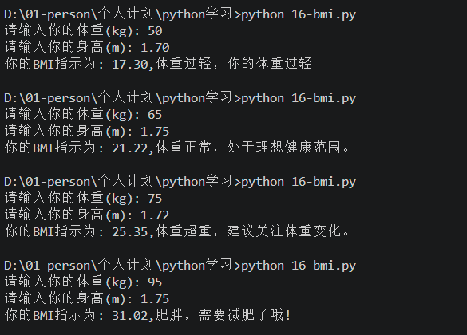

## 项目背景与需求分析

BMI（Body Mass Index）是衡量人体胖瘦程度的常用指标，计算公式为：

```
BMI = 体重（kg） / 身高（m）²
```

根据计算结果，可以参照不同标准给出健康建议。这里我采用**中国成人标准**：

| 分类 | BMI 范围 |
| :--- | :--- |
| 体重过轻 | BMI < 18.5 |
| 正常 | 18.5 ≤ BMI < 24.0 |
| 超重 | 24.0 ≤ BMI < 28.0 |
| 肥胖 | BMI ≥ 28.0 |

**程序目标**：

- 接收用户输入的体重（千克）和身高（米）
- 计算 BMI 值并保留两位小数
- 根据上述标准输出对应的健康提示

---

## 数据类型与输入处理

Python 中的 `input()` 函数总是返回**字符串（str）**。为了进行数学计算，我们必须将其转换为数值类型。这里体重和身高都可能是小数，所以选用 **浮点数（float）**。

```python
weight = float(input("请输入你的体重(kg): "))
height = float(input("请输入你的身高(m): "))
```

> **注意**：如果用户输入非数字字符，`float()` 会抛出 `ValueError`，但初学阶段我们暂不处理异常，假定用户输入合法。

---

## 算术运算——计算 BMI

计算公式直接翻译为 Python 表达式：

```python
bmi = weight / height ** 2
```

这里 `**` 表示幂运算，等价于 `height * height`。运算符优先级：`**` 高于 `/`，所以先计算身高平方，再做除法。为了更清晰，也可以写成：

```python
bmi = weight / (height * height)
```

---

## 流程控制——多分支判断

有了 BMI 值，需要根据范围输出不同结果。Python 提供了两种主流的多分支方案：`if-elif-else` 和 `match-case`（Python 3.10+）。

### 使用 `if-elif-else`（推荐）

这是最传统、最稳妥的方式，逻辑清晰，条件按顺序评估：

```python
if bmi < 18.5:
    print(f"你的BMI指数为: {bmi:.2f}，体重过轻，建议加强营养。")
elif bmi < 24:
    print(f"你的BMI指数为: {bmi:.2f}，体重正常，处于理想健康范围。")
elif bmi < 28:
    print(f"你的BMI指数为: {bmi:.2f}，体重超重，建议关注体重变化。")
else:
    print(f"你的BMI指数为: {bmi:.2f}，肥胖，需要减肥了哦！")
```

**为什么这样写更优雅？**

- 条件按"小于"递增，避免重复书写区间下限（如 `18.5 <= bmi`），减少出错。
- 最后一个 `else` 涵盖所有剩余情况（即 `bmi >= 28`），无需再写 `bmi >= 28`。

### 使用 `match-case`（Python 3.10+）

```python
match bmi:
    case bmi if bmi < 18.5:
        print(f"你的BMI指数为: {bmi:.2f}，体重过轻，建议加强营养。")
    case bmi if bmi < 24:
        print(f"你的BMI指数为: {bmi:.2f}，体重正常，处于理想健康范围。")
    case bmi if bmi < 28:
        print(f"你的BMI指数为: {bmi:.2f}，体重超重，建议关注体重变化。")
    case _:
        print(f"你的BMI指数为: {bmi:.2f}，肥胖，需要减肥了哦！")
```

> 这里利用了**顺序求值**：先检查是否 `< 18.5`，其次 `< 24`，再 `< 28`，最后 `_` 捕获所有 ≥ 28 的情况。

---

## 完整代码

### if-elif-else 版本（推荐）

```python
weight = float(input("请输入你的体重(kg): "))
height = float(input("请输入你的身高(m): "))

bmi = weight / height ** 2

if bmi < 18.5:
    print(f"你的BMI指数为: {bmi:.2f}，体重过轻，建议加强营养。")
elif bmi < 24:
    print(f"你的BMI指数为: {bmi:.2f}，体重正常，处于理想健康范围。")
elif bmi < 28:
    print(f"你的BMI指数为: {bmi:.2f}，体重超重，建议关注体重变化。")
else:
    print(f"你的BMI指数为: {bmi:.2f}，肥胖，需要减肥了哦！")
```

### match-case 版本（Python 3.10+）

```python
weight = float(input("请输入你的体重(kg): "))
height = float(input("请输入你的身高(m): "))

bmi = weight / height ** 2

match bmi:
    case bmi if bmi < 18.5:
        print(f"你的BMI指数为: {bmi:.2f}，体重过轻，建议加强营养。")
    case bmi if bmi < 24:
        print(f"你的BMI指数为: {bmi:.2f}，体重正常，处于理想健康范围。")
    case bmi if bmi < 28:
        print(f"你的BMI指数为: {bmi:.2f}，体重超重，建议关注体重变化。")
    case _:
        print(f"你的BMI指数为: {bmi:.2f}，肥胖，需要减肥了哦！")
```

---

## 运行测试




| 体重(kg) | 身高(m) | BMI | 结果 |
| :--- | :--- | :--- | :--- |
| 50 | 1.70 | 17.30 | 体重过轻 |
| 65 | 1.75 | 21.22 | 体重正常 |
| 75 | 1.72 | 25.35 | 体重超重 |
| 95 | 1.75 | 31.02 | 肥胖 |

所有分支均正确响应。

---

## 知识点总结

### 数据类型回顾
- `int`：整型，如 `18`
- `float`：浮点型，如 `1.75`
- `str`：字符串，用 `input()` 返回
- 类型转换：`float(input())` 将输入字符串转为浮点数

### 算术运算符
`+` `-` `*` `/` `**` 等。注意 `/` 总是返回浮点数，`**` 优先级最高。

### 流程控制要点
- **`if-elif-else`**：按顺序评估，进入第一个真条件后跳过剩余
- **`match-case`**：按顺序匹配模式，支持守卫，`_` 为通配符
- 区间判断时，利用**顺序**和**单向不等式**简化代码
- 务必包含所有逻辑分支，避免遗漏。使用 `else` 或 `_` 兜底是良好习惯

### 扩展思考
1. **异常处理**：如果用户输入字母或负数，程序会崩溃。可以尝试用 `try-except` 捕获异常
2. **多标准支持**：可以让用户选择使用中国标准还是国际标准（WHO）
3. **循环输入**：使用 `while` 循环让用户重复计算，直到输入特定命令退出
4. **精度控制**：`f"{bmi:.2f}"` 是格式化字符串的用法，保留两位小数

---

## 结语

通过这个 BMI 计算器的小项目，我们将**输入输出**、**数据类型转换**、**算术表达式**和**流程控制**串联起来，实现了一个有实际意义的程序。

初学者常常在 `if` 条件顺序或 `match` 守卫上犯错，但只要多加练习，就能熟练掌握。建议你亲手敲一遍代码，并尝试修改条件顺序观察结果，加深理解。

编程之路，始于动手。接下来你可以尝试为这个程序增加更多功能，比如循环计算、绘制趋势图等，不断挑战自己！
