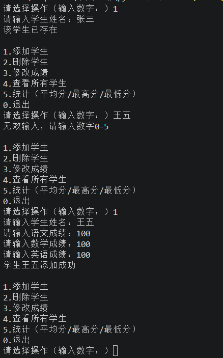
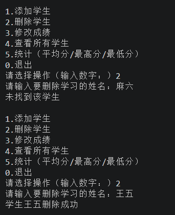
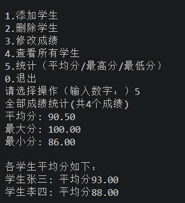
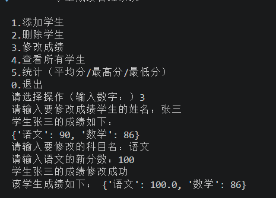

## 项目背景

学了列表、字典、循环和条件判断之后，最好的巩固方式就是做一个完整的程序来串联这些知识。学生成绩管理系统就是一个经典的练手项目。

**本篇用到的知识点**：字典嵌套（`dict` in `dict`）、列表和字典的遍历、流程控制（`if-elif-else`）、循环（`while` / `for`）、内置函数（`sum` / `max` / `min`）。

---

## 需求分析

这个程序要实现的功能：

```text
1. 添加学生（姓名 + 各科成绩）
2. 删除学生
3. 修改成绩
4. 查看所有学生
5. 统计（平均分/最高分/最低分）
0. 退出
```

---

## 数据结构设计

核心是数据怎么存。这里使用**字典嵌套**的结构：

```python
students = {
    "张三": {"语文": 90, "数学": 86},
    "李四": {"语文": 90, "数学": 86}
}
```

外层字典的 **key 是学生姓名**，**value 又是一个字典**（科目→成绩）。这样增删改查都很方便。

---

## 主循环与菜单

程序的核心是一个 `while True` 循环：

```python
while True:
    print("1.添加学生")
    print("2.删除学生")
    # ...
    choice = input("请选择操作：")

    if choice == "1":
        # 添加学生
    elif choice == "0":
        break
```

---

## 各功能实现

### 添加学生

先检查学生是否已存在，不存在则逐个科目输入成绩：

```python
name = input("请输入学生姓名：")
if name in students:
    print("该学生已存在")
    continue

scores = {}
for subject in SUBJECTS:
    scores[subject] = float(input(f"请输入{subject}成绩："))
students[name] = scores
```



### 删除学生

```python
if name in students:
    del students[name]
    print(f"学生{name}删除成功")
else:
    print("未找到该学生")
```



### 修改成绩

先确认学生和科目都存在，再更新分数：

```python
print(students[name])
subject = input("请输入要修改的科目名：")
students[name][subject] = float(input(f"请输入{subject}的新分数："))
```



### 查看所有学生

遍历字典打印所有数据：

```python
for name, scores in students.items():
    print(f"{name}: {scores}")
```



### 统计

收集所有成绩后计算：

```python
all_scores = []
for scores in students.values():
    all_scores.extend(scores.values())

total = sum(all_scores)
avg = total / len(all_scores)
print(f"平均分: {avg:.2f}")
print(f"最大分: {max(all_scores):.2f}")
print(f"最小分: {min(all_scores):.2f}")

# 各学生平均分
for name, scores in students.items():
    stu_avg = sum(scores.values()) / len(scores)
    print(f"学生{name}: 平均分{stu_avg:.2f}")
```


---

## 完整代码

```python
#学生成绩管理系统

students = {
    "张三": {"语文": 90, "数学": 86},
    "李四": {"语文": 90, "数学": 86}
}

SUBJECTS = ["语文", "数学", "英语"]

print("========学生成绩管理系统=========")

while True:
    print("\n1.添加学生")
    print("2.删除学生")
    print("3.修改成绩")
    print("4.查看所有学生")
    print("5.统计（平均分/最高分/最低分）")
    print("0.退出")

    choice = input("请选择操作（输入数字：）").strip()

    if choice == "1":
        name = input("请输入学生姓名：")
        if name in students:
            print("该学生已存在")
            continue
        scores = {}
        for subject in SUBJECTS:
            scores[subject] = float(input(f"请输入{subject}成绩："))
        students[name] = scores
        print(f"学生{name}添加成功")

    elif choice == "2":
        name = input("请输入要删除学生的姓名：")
        if name in students:
            del students[name]
            print(f"学生{name}删除成功")
        else:
            print("未找到该学生")

    elif choice == "3":
        name = input("请输入要修改成绩学生的姓名：")
        if name not in students:
            print("该学生不存在")
            continue
        print(f"学生{name}的成绩如下：")
        print(students[name])
        subject = input("请输入要修改的科目名：")
        if subject not in students[name]:
            print(f"该学生没有{subject}科目")
            continue
        students[name][subject] = float(input(f"请输入{subject}的新分数："))
        print("修改成功")

    elif choice == "4":
        if not students:
            print("暂无学生数据")
            continue
        for name, scores in students.items():
            print(f"{name}: {scores}")

    elif choice == "5":
        if not students:
            print("暂无学生数据")
            continue
        all_scores = []
        for scores in students.values():
            all_scores.extend(scores.values())

        total = sum(all_scores)
        count = len(all_scores)
        avg = total / count
        max_score = max(all_scores)
        min_score = min(all_scores)

        print(f"全部成绩统计(共{count}个成绩)")
        print(f"平均分: {avg:.2f}")
        print(f"最大分: {max_score:.2f}")
        print(f"最小分: {min_score:.2f}")

        print("\n各学生平均分如下：")
        for name, scores in students.items():
            stu_avg = sum(scores.values()) / len(scores)
            print(f"学生{name}: 平均分{stu_avg:.2f}")

    elif choice == "0":
        print("感谢使用，再见！")
        break
    else:
        print("无效输入，请输入数字0-5")
```

---

## 知识点总结

| 知识点 | 说明 |
| :--- | :--- |
| **字典嵌套** | `students[name] = {subject: score}` |
| **`in` 判断** | 检查学生/科目是否存在 |
| **`del` 删除** | 从字典中移除键值对 |
| **`for` 遍历字典** | `items()` / `values()` / `keys()` |
| **`while` 循环** | 菜单驱动的主循环结构 |
| **`extend` 合并列表** | `all_scores.extend(scores.values())` |
| **`sum` / `max` / `min`** | 内置数学函数 |

---

## 扩展思考

1. **保存到文件**：用 JSON 将数据保存到本地，程序重启后数据不丢失
2. **异常处理**：输入非数字成绩会崩溃，可以用 `try-except` 捕获
3. **自定义科目**：允许用户自定义科目，而不是固定语文数学英语
4. **函数化**：把每个功能封装成函数，主循环只负责调用
5. **图形界面**：学会 Tkinter 后可以加个 GUI
